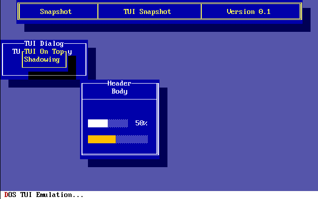

# SDL2 VGA Terminal 

| Monolithic CI | Note |
|:-------------:|-----:|
|| secondary check|
|| disabled|

| Linux (x64) | Windows (x86, x64) | macOS (x64) | Analyzer  |
|:-----------:|:------------------:|:-----------:|:---------:|
|||||

## SonarCloud

**NOTE:** Code Coverage is not yet computed

## Azure Pipelines

there are 5 pipelines, 1 for each OS and one dedicated to "Analysis", plus 1 for matrix build.

- The CI pipelines related to each OS are building and generating the artifacts.
  
  Only Linux is not runnig the tests due to missing video driver on CI.
  
  The test results are published in Azure Devops through `ctest -T Test` flag.

- The Analysis pipeline is analyzing the code, generating coverage and publish to codecov and SonarCloud.
- The Matrix pipeline is an overkill so it is just triggered manually when required.
  It is reflecting this table:

| FLAGS\OS             | Windows            | Linux              | macos              |
|:--------------------:|:------------------:|:------------------:|:------------------:|
| Debug                | :heavy_check_mark: | :heavy_check_mark: | :heavy_check_mark: |
| Release              | :heavy_check_mark: | :heavy_check_mark: | :heavy_check_mark: |
| BUILD_SHARED_LIBS    | :heavy_check_mark: | :heavy_check_mark: | :heavy_check_mark: |
| WITH_SDL2_STATIC     | :heavy_check_mark: | only               | only               |
| BUILD_TESTING        | :heavy_check_mark: | :heavy_check_mark: | :heavy_check_mark: |
| BUILD_EXAMPLES       | :heavy_check_mark: | :heavy_check_mark: | :heavy_check_mark: |
| BUILD_SNAPSHOT       | :heavy_check_mark: | :heavy_check_mark: | :heavy_check_mark: |
| TEST_DUMP_SNAPSHOT   | :no_entry:         | :no_entry:         | :no_entry:         |
| ENABLE_CODE_COVERAGE | :no_entry_sign:    | :no_entry_sign:    | :heavy_check_mark: |

- code coverage available only with LLVM and GCC in `cmake`, on CI working only on macos
- `TEST_DUMP_SNAPSHOT` is "forbidden" to test for the build as an helper flag only.

## Synopsis

It is just a VGA font terminal using SDL2.

the VGA fonts are related to [vgabios](http://savannah.nongnu.org/projects/vgabios/) project.

At the moment support only mode 3.

It should be on 16 colors in the classic way, but can support more thanks to SDL2.

It is just a matter of fonts and a terminal grid for displaying texts.

## Requirements

- `SDL2`

## Compiling

These are the requirements to compile the project from source:

-   `cmake 3.16`
-   `C++17`
-   `vcpkg` for dependency management
-   `gtest 1.10` for testing
-   `SDL_Image` for snapshot testing

## Usage

SDL2 Video sub-system has to be initialized before using `VgaTerminal` class.

There are few examples too in `examples` folder.

## Screenshot

This screenshot is also used in the snapshot test.

## Testing

using `GTest` framework.

There is a technique, snapshot testing, to verify some expectation, due to some required raster image to compare with,
there is a `boolean` option `TEST_DUMP_SNAPSHOT`, that will run the test suit for generating the expected result.
It could be a little bit risky, but it is a way to have generated expected results for the test suite.

The test suite take advantages of the option and will be compiled accordingly based on "dumping" or "testing".

please note if you are dumping the snapshot, you have to copy back to the `test/snapshot` directory to make them usable.

The filename generated are based on the test that are running, ideally: `[Test-suite.Test-name].png`

Just as a convention.

## Tui Terminal (Experimental)

This is just a show case and has not to be considered following the semantic versioning of the project,
it implies things might change with no objective reason at all.

It might could be detached completely and be its own library using this one.

At the moment is really very basic, error-prone and not well designed neither.

There is an example too among the examples.

### Screenshot

This is a TUI screenshot used in the snapshot test too.

## Projects Idea to be done in the future

- `VT Snake`  (retro-gaming style snake in an emulated DOS Text Mode)
- `VT Tetris` (retro-gaming style Tetris in an emulated DOS Text Mode)
- `VT Pong`   (retro-gaming style Pong in an emulated DOS Text Mode)
