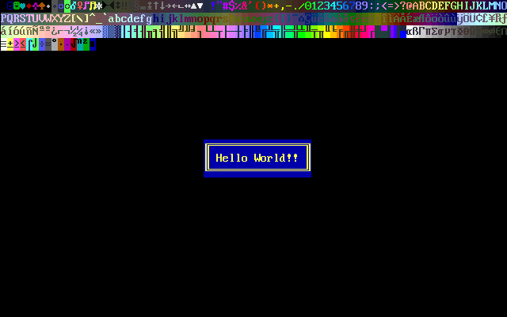

# SDL2 VGA Terminal 

| Windows (x86, x64); Linux (x64) |
|---------------------------------|
||

It is just a VGA font terminal using SDL2.

the VGA fonts are related to [vgabios](http://savannah.nongnu.org/projects/vgabios/) project.

At the moment support only mode 3.

It should be on 16 colors in the classic way, but can support more thanks to SDL2.

It is just a matter of fonts and a terminal grid for displaying texts.

## Compiling

Use `vcpkg` and install `SDL2`.

## Usage

SDL2 Video sub-system has to be initialized before using `VgaTerminal` class.

There are few examples usage as part of this cmake compilation too.

## Screenshot

This screenshot is also used in the snapshot test.

## Testing

using `GTest` framework.

There is a technique, snapshot testing, to verify some expectation, due to some required raster image to compare with,
there is a `boolean` option `TEST_DUMP_SNAPSHOT`, that will run the test suit for generating the expected result.
It could be a little bit risky, but it is a way to have generated expected results for the test suite.

The test suite take advantages of the option and will be compiled accordingly based on "dumping" or "testing".

please note if you are dumping the snapshot, you have to copy back to the `test/snapshot` directory to make them usable.

The filename generated are based on the test that are running, ideally: `[Test-suite.Test-name].png`

Just as a convention.
